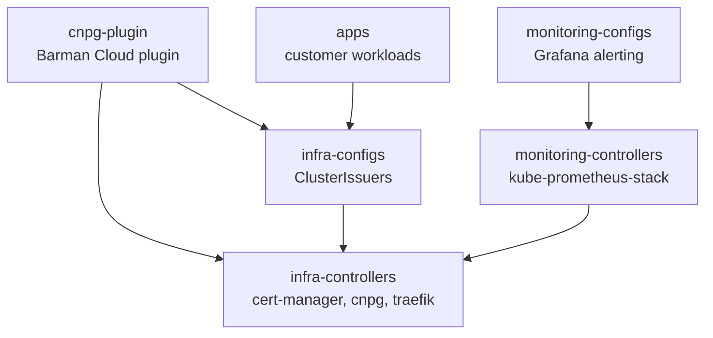
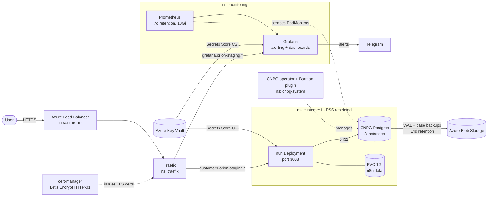

# orion-gitops

GitOps configuration for the **Orion** Kubernetes cluster (AKS), reconciled by
[Flux CD](https://fluxcd.io/). Everything running on the cluster — infra
controllers, monitoring stack, and tenant applications — is declared here and
applied automatically by Flux.

## Architecture

### Reconciliation flow

Flux watches this repository (`GitRepository` source `orion-staging`) and
reconciles six `Kustomization` resources listed in
[`flux-system/kustomization.yaml`](flux-system/kustomization.yaml). They form a
dependency graph (arrows point from a stage to what it waits on):



| Kustomization | Path | Depends on | Health checks |
|---|---|---|---|
| `infra-controllers` | `infrastructure/controllers/staging` | — | HelmReleases `cert-manager`, `cnpg`, `traefik`; cert-manager webhook Deployment |
| `infra-configs` | `infrastructure/configs/staging` | `infra-controllers` | — |
| `cnpg-plugin` | `infrastructure/cnpg-plugin/staging` | `infra-controllers`, `infra-configs` | — |
| `monitoring-controllers` | `monitoring/controllers/staging` | `infra-controllers` | HelmRelease `kube-prometheus-stack` |
| `monitoring-configs` | `monitoring/configs/staging` | `monitoring-controllers` | — |
| `apps` | `apps/staging` | `infra-configs` | — |

All of them reconcile every 5 minutes with `prune: true`, so deleting a
manifest from Git deletes the object from the cluster. The controllers
Kustomizations wait for Helm releases to be healthy before dependents start.
The CRD-providing controllers (cert-manager, CNPG, Prometheus operator) must be
up before anything that uses their custom resources (`ClusterIssuer`,
`Cluster`, `ObjectStore`, `PrometheusRule`, ...) is applied.

Cluster-specific values (`AKS_KEYVAULT_IDENTITY_CLIENT_ID`, `AZURE_TENANT_ID`,
`TRAEFIK_IP`, ...) are not stored in Git. The `infra-controllers`,
`monitoring-controllers`, and `apps` Kustomizations substitute them at apply
time (`postBuild.substituteFrom`) from a `cluster-vars` ConfigMap in
`flux-system`.

### Runtime topology



### Components

**Ingress and TLS** (`infrastructure/controllers/base/{traefik,cert-manager}`)
- Traefik (chart `37.4.0`) runs in the `traefik` namespace with a fixed
  `loadBalancerIP` from `${TRAEFIK_IP}`. Its IngressClass is renamed to
  `traefik` (the chart default is `traefik-traefik`).
- cert-manager (`v1.19.1`) provides two `ClusterIssuer`s,
  `letsencrypt-staging` and `letsencrypt-prod`, both using HTTP-01 through the
  `traefik` ingress class. Ingresses request certs with the
  `cert-manager.io/cluster-issuer` annotation.

**Databases** (`infrastructure/controllers/base/cnpg`, `infrastructure/cnpg-plugin`)
- The CloudNativePG operator (chart `0.26.1`) runs in `cnpg-system` and
  manages Postgres `Cluster` resources.
- The Barman Cloud plugin (`plugin-barman-cloud` `0.3.1`) handles continuous
  WAL archiving and base backups to object storage. It depends on cert-manager
  (for its webhook certificates) and CNPG, which is why `cnpg-plugin` waits on
  both `infra-controllers` and `infra-configs`.

**Monitoring** (`monitoring/`)
- `kube-prometheus-stack` (`80.2.0`) with **Alertmanager disabled**. Alerting
  is done by Grafana's native alerting instead.
- Prometheus keeps 7 days of data on a 10Gi PVC. Selector defaults are
  loosened (`*SelectorNilUsesHelmValues: false`, all PodMonitor namespaces) so
  it can pick up `PodMonitor`s from application namespaces, which the CNPG
  database alerts rely on. The `customer1-db` `Cluster` does not currently set
  `monitoring.enablePodMonitor`, so confirm the `cnpg_*` metrics are actually
  being scraped.
- Chart values live in `values.yaml` and are fed to the HelmRelease via a
  Kustomize `configMapGenerator` + `valuesFrom`. `kustomizeconfig.yaml` teaches
  Kustomize to rewrite the generated ConfigMap's hashed name inside the
  HelmRelease.
- Grafana is exposed at `grafana.orion-<env>.dcinfrastructures.io` behind
  Traefik with a Let's Encrypt cert. Its sidecars load anything in the
  `monitoring` namespace labeled `grafana_dashboard: "1"` or `grafana_alert:
  "1"`, which is how `monitoring/configs/*/grafana/alerting/` works: each file
  is a labeled ConfigMap containing Grafana alert-provisioning YAML.
- Alert groups: node, pod, database (backup failure, WAL archiving, replication
  lag, replica not streaming, long transactions, fencing), CNPG operator, and
  n8n. All route through one notification policy to a Telegram contact point.

**Tenant application** (`apps/base/customer1`)

Each tenant is one namespace (`pod-security.kubernetes.io/enforce: restricted`)
containing:

| Resource | Purpose |
|---|---|
| `Deployment` (n8n, 1 replica, `Recreate`) | Non-root, read-only root FS, all capabilities dropped, seccomp `RuntimeDefault`, with `/tmp` and `.cache` as `emptyDir`s |
| `Cluster` (CNPG, 3 instances, 1Gi) | n8n's Postgres, reached at `customer1-db-rw.customer1.svc:5432` |
| `ObjectStore` + `ScheduledBackup` | Barman backups to Azure Blob, daily at 03:00, 14-day retention |
| `PersistentVolumeClaim` (1Gi) | n8n's `/home/node/.n8n` data |
| `SecretProviderClass` | Pulls DB credentials and the backup SAS token from Key Vault |
| `Service` + `Ingress` | Routes `customer1.<env-domain>` to port 3008 with TLS |
| `CiliumNetworkPolicy` | Allows ingress only from the `traefik` namespace. Egress only to the tenant DB (5432), kube-dns (53/UDP), and external HTTPS (443) |

**Secrets flow.** No secrets are stored in Git. Pods use the AKS Key Vault
managed identity (`useVMManagedIdentity`) and mount a Secrets Store CSI volume.
The `SecretProviderClass` `secretObjects` sync Key Vault values into ordinary
Kubernetes Secrets (`customer1-db-credentials`, `customer1-n8n-env`,
`customer1-backup-creds`, `grafana-env`, `grafana-admin-credentials`). Those
Secrets exist only while a pod that mounts the CSI volume is running, which is
why the Deployments and Grafana mount `/mnt/secrets-store` even though nothing
reads files from it.

**Environment separation.** Base manifests hold everything common. Overlays
patch only what differs, for example:

| Setting | Staging | Production |
|---|---|---|
| Key Vault | `kv-orion-staging-*` | `kv-orion-prod` |
| Grafana host | `grafana.orion-staging.dcinfrastructures.io` | `grafana.orion-prod.dcinfrastructures.io` |
| Tenant ingress host, backup `destinationPath`, identity IDs | patched in `apps/staging/customer1` | not yet created |

### Adding a tenant

Copy `apps/base/customer1` to `apps/base/<tenant>`, rename resources and
namespace, then add an overlay under `apps/staging/<tenant>` that patches the
ingress host, backup `destinationPath`, and Key Vault identity, and list it in
`apps/staging/kustomization.yaml`. Flux picks it up on the next sync.

## Repository layout

```
flux-system/     Flux Kustomization objects that wire the whole pipeline together
infrastructure/  Cluster platform services
  controllers/     Helm releases: cert-manager, CloudNativePG (cnpg), Traefik
  configs/         Config objects for the controllers above (e.g. ClusterIssuers)
  cnpg-plugin/     CloudNativePG Barman Cloud plugin release
monitoring/      Observability stack
  controllers/     kube-prometheus-stack Helm release
  configs/         Grafana alerting rules & contact points (node/pod/db/n8n/cnpg alerts)
apps/            Tenant / customer workloads (e.g. customer1's n8n instance + Postgres)
```

Every component follows the same **base + overlay** Kustomize pattern:

```
<component>/base/<name>/          # environment-agnostic manifests
<component>/staging/<name>/       # staging overlay (patches over base)
<component>/production/<name>/    # production overlay (patches over base)
```

Overlays patch things like ingress hostnames, backup destination paths, and
Key Vault identity IDs to be environment-specific.

> **Note:** at present every `flux-system/*.yaml` Kustomization points at the
> `staging` paths and the `orion-staging` GitRepository source. Production
> overlays exist under `infrastructure/`, `monitoring/`, and would need
> equivalent `apps/production/` manifests and Flux `Kustomization`/
> `GitRepository` objects pointed at them to go live.

## What's deployed

- **Ingress / TLS**: Traefik as ingress controller, cert-manager with
  Let's Encrypt (staging + prod) `ClusterIssuer`s solving HTTP-01 via Traefik.
- **Database**: CloudNativePG (`cnpg`) operator + Barman Cloud plugin for
  Postgres clusters with WAL archiving and scheduled backups to Azure Blob
  Storage.
- **Monitoring**: kube-prometheus-stack (Prometheus, Alertmanager, Grafana)
  with Grafana-managed alert rules for nodes, pods, databases, the CNPG
  operator, and the n8n application, plus notification policies/contact
  points.
- **Applications**: `apps/base/customer1` — an [n8n](https://n8n.io/)
  deployment backed by a dedicated CNPG Postgres cluster, Azure Blob object
  store for backups, Azure Key Vault-backed secrets (via the Secrets Store
  CSI Driver), persistent storage, a network policy, and a TLS ingress.

## Making changes

1. Edit manifests under the relevant `base/` directory, or the environment
   overlay if the change is environment-specific.
2. Validate the Kustomize build locally, e.g.:
   ```sh
   kustomize build apps/staging
   kustomize build infrastructure/controllers/staging
   ```
3. Commit and push — Flux reconciles automatically on its configured
   interval (5 minutes for most `Kustomization`s in this repo). To force an
   immediate sync with the Flux CLI:
   ```sh
   flux reconcile kustomization apps -n flux-system --with-source
   ```

## Prerequisites for a new environment/cluster

- Flux bootstrapped against this repo with a `GitRepository` source and a
  `cluster-vars` ConfigMap providing the substitution variables referenced in
  overlays (e.g. `AKS_KEYVAULT_IDENTITY_CLIENT_ID`, `AZURE_TENANT_ID`).
- Azure Blob Storage containers/SAS tokens for CNPG backups and the
  Azure Key Vault CSI driver installed for secret mounting.
